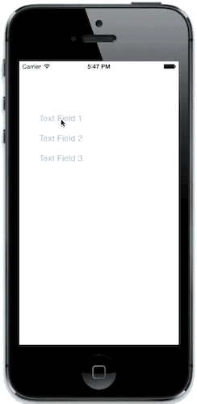

# MIMInputToolbar

A very simple gem that provides the one MIMInputToolbar class which you can use as the input accessory view for your UITextFields and UITextViews.



## Installation

Add this line to your application's Gemfile:

    gem 'MIMInputToolbar'

And then execute:

    $ bundle

Or install it yourself as:

    $ gem install MIMInputToolbar

## Usage

After installing the gem / adding it to your Gemfile, start off by creating an instance of `MIMInputToolbar`.

```ruby
@field_bar = MIMInputToolbar.new
```

Give each input the instance through it's input accessor view property.

```ruby
@text_field_one.inputAccessoryView = @field_bar
@text_field_two.inputAccessoryView = @field_bar
@text_field_three.inputAccessoryView = @field_bar
```

Then finally, give the instance all the fields (in the correct order) that it will be navigating through.

```ruby
@field_bar.fields = [@text_field_one, @text_field_two, @text_field_three]
```

You can optionally set the title for the `Previous` / `Next` / and `Done` buttons like so

```ruby
@field_bar.previous_title = " < "
@field_bar.next_title = " > "
@field_bar.done_title = "Complete"
```

This works really well with the [TPKeyboardAvoiding](https://github.com/michaeltyson/TPKeyboardAvoiding).

## Contributing

Big thank you to [Gant Laborde](https://github.com/GantMan) and [Mark Rickert](https://github.com/markrickert) who have been pushing this forward.

1. Fork it
2. Create your feature branch (`git checkout -b my-new-feature`)
3. Commit your changes (`git commit -am 'Add some feature'`)
4. Push to the branch (`git push origin my-new-feature`)
5. Create new Pull Request
